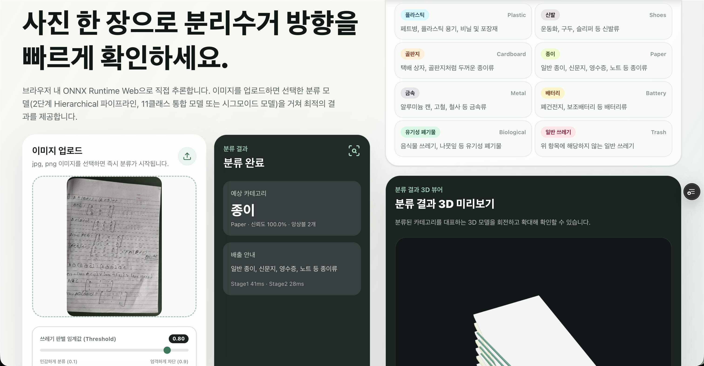

# GarbageClassification

> 이미지 한 장으로 분리수거 방향을 알려주는 오픈소스 딥러닝 웹 서비스



쓰레기 사진을 업로드하면 브라우저에서 직접 동작하는 ONNX 모델 추론으로 **재활용 카테고리**를 알려줍니다. 별도의 백엔드 서버 없이 전 과정이 클라이언트에서 완결되며, 이미지가 외부로 전송되지 않아 프라이버시 보호도 함께 보장합니다.

배포 데모: https://garbage-classification-sandy.vercel.app/

---

## ✨ 주요 기능

- **클라이언트 사이드 추론** — ONNX Runtime Web 기반. 별도 API 서버 없음
- **계층적 앙상블 파이프라인** — Stage 1(쓰레기 판별) → Stage 2(10클래스 분류)
- **모델 스왑 옵션** — FP32 앙상블 / FP32 단일 / 멀티레이블 시그모이드 모델 선택 가능
- **사용자 조절 가능한 threshold** — Stage 1 쓰레기 판별 임계값을 UI에서 조절 가능
- **3D 미리보기** — 분류 결과에 따른 3D 모델을 함께 시각화

---

## 🧠 아키텍처

```
입력 이미지
    │
    ▼
[Stage 1] 쓰레기 판별 (binary classifier)
    │  쓰레기가 아님 → "쓰레기가 아닙니다" 반환
    │  쓰레기임 ↓
    ▼
[Stage 2] 10클래스 분류 (앙상블 / 단일 / 시그모이드)
    │
    ▼
최종 분류 결과
```

전체 흐름은 다음과 같습니다.

1. 사용자가 브라우저에서 이미지를 업로드합니다.
2. 클라이언트가 이미지를 224×224로 리사이즈하고 ImageNet 통계로 정규화합니다.
3. Stage 1 모델이 이미지가 쓰레기인지 여부를 판단합니다(임계값 기본 0.8).
4. 쓰레기로 판정되면 Stage 2 모델(들)이 10클래스 중 하나로 분류합니다.
5. 앙상블 모드에서는 여러 모델의 예측을 다수결(hard voting)로 종합합니다.

---

## ♻️ 분류 클래스 (10종)

| # | 클래스 | 한국어 | 예시 |
|---|--------|--------|------|
| 1 | `Clothes` | 의류 | 의류, 헌 옷, 직물류 |
| 2 | `Glass` | 유리 | 유리병, 유리 조각 |
| 3 | `Plastic` | 플라스틱 | 페트병, 플라스틱 용기, 비닐 |
| 4 | `Shoes` | 신발 | 운동화, 구두, 슬리퍼 |
| 5 | `Cardboard` | 골판지 | 택배 상자, 골판지 |
| 6 | `Paper` | 종이 | 일반 종이, 신문지, 영수증 |
| 7 | `Metal` | 금속 | 알루미늄 캔, 고철, 철사 |
| 8 | `Battery` | 배터리 | 폐건전지, 보조배터리 |
| 9 | `Biological` | 유기성 폐기물 | 음식물 쓰레기, 나뭇잎 |
| 10 | `Trash` | 일반 쓰레기 | 위 항목에 해당하지 않는 쓰레기 |

---

## 🛠 기술 스택

| 영역 | 기술 |
|------|------|
| 모델 학습 | PyTorch |
| 모델 변환/경량화 | ONNX, ONNX Runtime (양자화) |
| 브라우저 추론 | ONNX Runtime Web |
| 프론트엔드 | React 19, Vite 6, Tailwind CSS 4 |
| 3D 시각화 | three.js, @react-three/fiber, @react-three/drei |

---

## 📁 폴더 구조

```
GarbageClassification/
├── AI/
│   ├── train/          # PyTorch 학습 스크립트 (Stage 1·2, sigmoid)
│   ├── export/         # ONNX 변환 및 양자화 스크립트
│   ├── inference/      # Python 추론 유틸리티
│   ├── preprocessing/  # 데이터 전처리 (증강 포함)
│   └── models/         # 학습된 ONNX 모델
├── Frontend/
│   ├── public/models/  # 브라우저에서 로드하는 ONNX 모델
│   └── src/
│       ├── inference/  # 브라우저 추론 파이프라인
│       └── components/ # UI 컴포넌트 (결과 3D 뷰어 등)
├── Assets/             # 데모 이미지 등 정적 자산
├── Dataset/            # 데이터셋 (.gitignore — 학습 시 다운로드)
├── Docs/               # 추가 문서
└── requirements.txt    # Python 의존성
```

---

## 🚀 시작하기

### 사전 요구사항

- **Node.js** ≥ 18 (Frontend)
- **Python** ≥ 3.10 (모델 재학습/변환 시)
- npm 또는 호환 패키지 매니저

### 프론트엔드 실행

`Frontend/` 디렉터리에 React + Vite 앱이 들어있습니다.

```bash
cd Frontend
npm install
npm run dev
```

실행 후 브라우저에서 `http://localhost:5173/`로 접속하면 화면을 확인할 수 있습니다.

프로덕션 빌드는 아래 명령어로 생성합니다.

```bash
npm run build
npm run preview   # 빌드 결과 미리보기
```

ONNX 모델은 이미 `Frontend/public/models/`에 포함되어 있어, 별도의 모델 다운로드 없이 바로 추론이 가능합니다.

### 모델 재학습 (선택)

이미 학습된 ONNX 모델이 포함되어 있으므로 일반 사용자는 이 단계를 건너뛰어도 됩니다. 모델을 직접 학습하려면:

```bash
# 1. Python 의존성 설치
pip install -r requirements.txt

# 2. 데이터셋 준비 (자동 다운로드 + 압축 해제)
python AI/train/prepare_dataset.py

# 3. Stage 1 (쓰레기 판별 이진 분류) 학습
python AI/train/train_stage1.py

# 4. Stage 2 (10클래스 분류) 학습
python AI/train/train_stage2.py

# 5. (선택) 멀티레이블 시그모이드 모델 학습
python AI/train/train_sigmoid.py

# 6. ONNX 변환
python AI/export/export_checkpoint_to_onnx.py
```

데이터셋 준비/증강 관련 자세한 내용은 [`AI/train/README.md`](AI/train/README.md)를 참고하세요.

---

## 📖 사용법

1. 웹 페이지에 접속합니다.
2. 우측 상단에서 사용할 **모델 프리셋**을 선택합니다.
   - **FP32 앙상블 (정확도 우선)** — Stage 2 두 개의 모델을 다수결로 종합. 가장 안정적
   - **FP32 단일 (균형)** — Stage 2 단일 모델로 빠르게 추론
   - **시그모이드 모델 (멀티레이블 기반)** — 한 이미지가 여러 카테고리에 해당할 수 있음을 가정한 모델
3. 필요 시 **쓰레기 판별 임계값(threshold)**을 조절합니다(기본 0.8).
4. 좌측 영역에 이미지를 **업로드**(클릭 또는 드래그 앤 드롭)합니다.
5. 우측에서 분류 결과와 카테고리 안내, 3D 미리보기를 확인합니다.

---

## 🤝 기여하기

오픈소스 프로젝트로서 모든 형태의 기여를 환영합니다.

1. 이 저장소를 Fork
2. `develop` 브랜치에서 새 `feature/<이름>` 브랜치 생성
3. 변경 사항을 커밋 — 커밋 메시지는 `feat:`, `fix:`, `docs:`, `chore:` 등 [Conventional Commits](https://www.conventionalcommits.org/) 스타일을 따릅니다
4. `develop` 브랜치로 Pull Request 생성 — PR 본문은 `.github/pull_request_template.md` 양식을 사용합니다
5. 관련 이슈가 있다면 `Closes #번호`로 연결

작업 시작 전에는 **이슈를 먼저 생성**해 주세요. 자세한 워크플로(브랜치 전략, 커밋 규칙 등)는 [`CLAUDE.md`](CLAUDE.md)를 참고하세요.

---

## 👥 팀 (Team 3610)

| 이름   | 역할              |
| ------ | ----------------- |
| 최재현 | PM, 프로젝트 관리 |
| 권시헌 | 데이터 전처리     |
| 김건민 | 모델 학습         |
| 김민성 | 웹 페이지 개발    |
